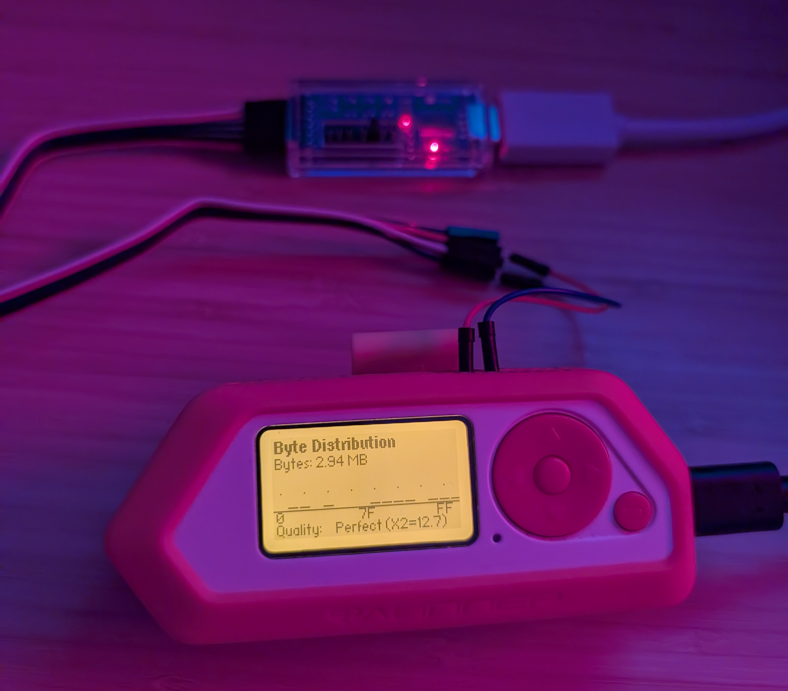

# 🔬 Entropy Lab v1.0

**Professional entropy generation and analysis laboratory for Flipper Zero**

[](https://github.com/lmacken/FlipperEntropyLab)
[](LICENSE)
[](https://flipperzero.one)

Transform your Flipper Zero into a professional-grade entropy generation and analysis laboratory. Entropy Lab combines multiple independent hardware sources, advanced cryptographic mixing, and comprehensive statistical analysis to produce high-quality random data suitable for security applications, research, and cryptographic use cases.





---

## ⚠️ Disclaimer

**EXPERIMENTAL SOFTWARE - USE AT YOUR OWN RISK**

This is experimental entropy generation software provided for research, educational, and testing purposes. While it implements industry-standard cryptographic techniques and hardware random number generation, we make **NO WARRANTIES** about the quality, randomness, or suitability of the generated entropy for any purpose.

**Important:**
- 🔴 Not certified for production cryptographic use
- 🔴 No guarantee of entropy quality or distribution
- 🔴 Use at your own risk for security-critical applications
- 🔴 Always verify entropy quality with statistical testing
- 🔴 Consider this a research/educational tool, not production-ready

**We are not responsible for:**
- Any loss, damage, or security breach resulting from use of this software
- The quality or randomness of generated entropy
- Fitness for any particular purpose
- Any consequences of using generated passphrases or random data

**Recommendations:**
- ✅ Test entropy quality thoroughly before any critical use
- ✅ Use multiple independent entropy sources when possible
- ✅ Combine with other RNG sources for production systems
- ✅ Always perform statistical validation (NIST, Dieharder, etc.)

**By using this software, you acknowledge and accept these risks.**

---

## 📋 Table of Contents

- [Features](#-features)
- [Installation](#-installation)
- [Quick Start](#-quick-start)
- [Usage Guide](#-usage-guide)
- [Technical Specifications](#-technical-specifications)
- [Applications](#-applications)
- [Building from Source](#-building-from-source)
- [Documentation](#-documentation)
- [Contributing](#-contributing)
- [License](#-license)

---

## ✨ Features

### 🎲 Multi-Source Entropy Collection

Entropy Lab leverages multiple independent hardware sources to generate high-quality randomness:

- **🎯 Hardware TRNG** - [STM32WB55](https://www.st.com/en/microcontrollers-microprocessors/stm32wb55rg.html) True Random Number Generator
  - 32 bits per sample
  - Cryptographically secure
  - [NIST SP 800-90B](https://csrc.nist.gov/publications/detail/sp/800-90b/final) compliant
  - [Datasheet](https://www.st.com/resource/en/datasheet/stm32wb55rg.pdf) | [Reference Manual](https://www.st.com/resource/en/reference_manual/rm0434-multiprotocol-wireless-32bit-mcu-armbased-cortexm4-with-fpu-bluetooth-lowenergy-and-802154-radio-solution-stmicroelectronics.pdf)
  
- **📡 RF Atmospheric Noise** - [CC1101](https://www.ti.com/product/CC1101) Sub-GHz Transceiver (315/433/868/915 MHz)
  - 10 bits per sample  
  - Atmospheric RF noise from cosmic rays and environmental EM
  - Multi-band sampling for diversity
  - [Datasheet](https://www.ti.com/lit/ds/symlink/cc1101.pdf)
  
- **📺 Infrared Signal Entropy** - IR Receiver
  - 8 bits per sample
  - **Interactive entropy source** - use a TV remote to send IR signals
  - Point a lighter flame at the IR sensor for raw thermal IR data
  - Can capture fluorescent light flicker (50/60Hz) and photodiode noise
  - Note: Works best with active IR sources, not purely ambient

- **⚙️ Configurable Sources** - Mix and match sources for your needs
  - All sources combined (default)
  - Hardware-only mode
  - Custom combinations

### 🔐 Advanced Cryptographic Processing

- **Hardware AES Mixing** - STM32 AES acceleration for [entropy pool mixing](https://en.wikipedia.org/wiki/Entropy_(computing))
- **Software XOR Mixing** - High-performance software fallback option
- **4KB Entropy Pool** - Large circular buffer with sophisticated [LFSR-based mixing](https://en.wikipedia.org/wiki/Linear-feedback_shift_register)
- **[Rejection Sampling](https://en.wikipedia.org/wiki/Rejection_sampling)** - Eliminates [modulo bias](https://research.kudelskisecurity.com/2020/07/28/the-definitive-guide-to-modulo-bias-and-how-to-avoid-it/) in passphrase generation

### 🗝️ Cryptographic Passphrase Generator

Generate cryptographically secure passphrases using industry-standard wordlists:

| Wordlist | Words | Bits/Word | Standard |
|----------|-------|-----------|----------|
| **EFF Large** | 7,776 | 12.93 | Electronic Frontier Foundation diceware |
| **BIP-39** | 2,048 | 11.0 | Bitcoin mnemonic seed standard |
| **SLIP-39** | 1,024 | 10.0 | Shamir's Secret Sharing standard |

**Features:**
- 3-12 word configurable length
- Cryptographically secure word selection with [CSPRNG](https://en.wikipedia.org/wiki/Cryptographically_secure_pseudorandom_number_generator)
- No [modulo bias](https://research.kudelskisecurity.com/2020/07/28/the-definitive-guide-to-modulo-bias-and-how-to-avoid-it/) ([rejection sampling](https://en.wikipedia.org/wiki/Rejection_sampling) implementation)
- Embedded wordlists (no SD card required)
- Optional SD card support for extended wordlists
- Real-time entropy calculations

**Example Passphrases:**
```
5 words (64.6 bits): "flanking unharmed whimsical deftly porkchop"
7 words (90.5 bits): "flanking unharmed whimsical deftly porkchop avalanche tidiness"
```

### 📊 Professional Analysis Tools

#### 🎨 Real-Time Visualization

Entropy Lab features an awesome visualization system that lets you see randomness in action:

- **Random Walk** - Watch entropy evolve as a 2D random walk across the screen
- **Pixel Scatter** - See random data as scattered pixels showing distribution
- **Live Patterns** - Real-time entropy generation visualization
- **Multiple Modes** - Switch between different visualization algorithms
- **Statistics Overlay** - View generation rates and byte counts in real-time

#### 📈 Byte Distribution Analysis
- Real-time histogram (16 bins)
- Statistical distribution verification
- Quality assessment indicators
- Uniform distribution monitoring

#### 📡 Entropy Source Statistics
- Per-source contribution tracking
- Bits/second rates for each source
- Source comparison and analysis
- Total bits and rate calculations

#### 🔬 Quality Testing Suite
- **[Chi-square Distribution Test](https://en.wikipedia.org/wiki/Chi-squared_test)** - Verify uniform distribution
- **Bit Frequency Analysis** - Detect bias in generated bits
- **[Runs Test](https://en.wikipedia.org/wiki/Wald%E2%80%93Wolfowitz_runs_test)** - Pattern detection in output sequences
- **Configurable Test Sizes** - 4KB, 8KB, 16KB samples
- **Statistical Quality Scoring** - Pass/fail indicators

### 📤 Flexible Output Options

- **🖥️ UART Output** - Hardware serial output via GPIO pins (115200 baud)
- **💾 File Storage** - Save entropy to SD card files
- **📊 Always-On Visualization** - Monitor generation in real-time

### 💡 User Experience

- **🚦 LED Status** - Red (stopped), Green (generating)
- **📱 Clean Interface** - Optimized for Flipper Zero screen
- **🔋 Power Efficient** - Configurable polling intervals

---

## 🛠️ Installation

### Method 1: Pre-built Release (Recommended)

1. Download `entropylab.fap` from the [releases page](https://github.com/lmacken/FlipperEntropyLab/releases)
2. Copy to your Flipper Zero: `/ext/apps/Tools/entropylab.fap`
3. Launch from **Apps** → **Tools** → **Entropy Lab**

### Method 2: qFlipper

1. Connect your Flipper Zero via USB
2. Open qFlipper
3. Navigate to **Apps** tab
4. Click **Install from file**
5. Select `entropylab.fap`
6. Done! ✅

### Method 3: SD Card

1. Remove SD card from Flipper Zero
2. Copy `entropylab.fap` to `/ext/apps/Tools/` directory
3. Insert SD card back into Flipper Zero
4. Navigate to **Apps** → **Tools** → **Entropy Lab**

**What Gets Installed:**
```
/ext/apps/Tools/entropylab.fap           # Main app (187KB)
/ext/apps/Tools/entropylab/wordlists/    # Bundled wordlists
├── eff_large_wordlist.txt               # EFF wordlist (7,776 words)
├── bip39_english.txt                    # BIP-39 wordlist (2,048 words)
└── slip39_english.txt                   # SLIP-39 wordlist (1,024 words)
```

---

## 🚀 Quick Start

1. **Launch the App**
   - Navigate to **Apps** → **Tools** → **Entropy Lab**

2. **Start Generating**
   - Select **Start Generator** from the main menu
   - LED will turn blinking green

3. **Boost IR Entropy (Optional)**
   - Point a TV remote at your Flipper and press buttons
   - Wave a lighter flame in front of the IR sensor
   - Check the Sources view to see IR entropy contribution

4. **View Entropy**
   - Select **Visualize** to see live entropy generation
   - Select **Distribution** to see byte histogram
   - Select **Sources** to see per-source statistics

5. **Generate Passphrase**
   - Select **Passphrase Generator**
   - Choose word count (3-12 words)
   - Press OK to generate secure passphrase

6. **Test Quality**
   - Select **Test Quality**
   - Choose test size (4KB, 8KB, or 16KB)
   - Watch statistical analysis in real-time

---

## 📖 Usage Guide

### ⚙️ Configuration

Access configuration via **Config** menu:

#### Entropy Sources
- **All** - Combined hardware, RF, and IR sources (recommended)
- **HW Only** - Hardware TRNG only (fastest, high quality)
- **HW+RF** - Hardware + atmospheric RF noise
- **HW+IR** - Hardware + infrared ambient noise
- **RF+IR** - Pure environmental sources

#### Pool Mixing
- **HW AES** - Hardware-accelerated AES mixing (default, fastest)
- **SW XOR** - Software XOR mixing (fallback, compatible)

#### Output Mode
- **UART** - Hardware serial output via GPIO pins (115200 baud)
- **File** - Save random data to SD card

#### Wordlist Selection
- **EFF Large** - 7,776 words, ~12.93 bits/word (recommended)
- **BIP-39** - 2,048 words, ~11.0 bits/word (Bitcoin standard)
- **SLIP-39** - 1,024 words, ~10.0 bits/word (Shamir sharing)

#### Performance Tuning
- **Poll Rate** - 1ms to 500ms (entropy collection frequency)
- **Visual Rate** - 100ms to 1s (display refresh rate)

### 📊 Analysis Features

#### 🔬 Quality Testing

1. Navigate to **Test Quality**
2. Select test size:
   - 4KB - Quick test (~5 seconds)
   - 8KB - Standard test (~10 seconds)
   - 16KB - Comprehensive test (~20 seconds)
3. Watch real-time analysis:
   - **Chi-square Test** - Distribution uniformity (target: ~255)
   - **Bit Frequency** - Bit balance (target: 50%)
   - **Runs Test** - Pattern detection (target: expected runs)
   - **Overall Score** - Pass/fail indicator

#### 📈 Distribution Analysis

- Navigate to **Distribution** for real-time byte histogram
- Monitor statistical distribution of generated data
- Verify uniform distribution across all byte values
- 16 bins covering range 0-255

#### 📡 Source Performance

- Navigate to **Sources** for per-source statistics
- View contribution from each entropy source
- Monitor bits/second rates
- Toggle between total bits and rate display
- Example output:
  ```
  HW RNG:    3,200 bits
  SubGHz RF:   100 bits  
  IR Noise:     80 bits
  
  Rate: 156 bits/sec
  ```

### 🗝️ Secure Passphrase Generation

#### Standard Generation (Embedded Wordlist)

1. Navigate to **Passphrase Generator**
2. Select wordlist type (EFF, BIP-39, or SLIP-39)
3. Configure word count (3-12 words):
   - 3 words: ~38.8 bits (basic security)
   - 5 words: ~64.6 bits (strong security)
   - 7 words: ~90.5 bits (very strong)
   - 12 words: ~155.1 bits (maximum security)
4. Press **OK** to generate
5. Press **OK** again to generate new passphrase

#### Entropy Calculations

| Words | EFF Large | BIP-39 | SLIP-39 |
|-------|-----------|--------|---------|
| 3 | 38.8 bits | 33.0 bits | 30.0 bits |
| 5 | 64.6 bits | 55.0 bits | 50.0 bits |
| 7 | 90.5 bits | 77.0 bits | 70.0 bits |
| 12 | 155.1 bits | 132.0 bits | 120.0 bits |

**Security Notes:**
- [Rejection sampling](https://en.wikipedia.org/wiki/Rejection_sampling) eliminates [modulo bias](https://research.kudelskisecurity.com/2020/07/28/the-definitive-guide-to-modulo-bias-and-how-to-avoid-it/)
- Each word selected with cryptographically secure randomness
- ⚠️ **Experimental software** - verify quality before critical use
- Suitable for password managers and cryptographic applications (with proper validation)
- Recommended: 5+ words for strong security

### 📤 Output Modes

#### UART Output

Connect to GPIO pins for hardware serial output:

**Pin Configuration:**
- TX: GPIO pin 13 (C0)
- RX: GPIO pin 14 (C1)
- GND: GPIO pin 18

**Connection Example:**
```bash
# Linux
screen /dev/ttyUSB0 115200

# macOS
screen /dev/cu.usbserial 115200

# Collect entropy
dd if=/dev/ttyUSB0 of=random.bin bs=1024 count=1024

# Seed Linux entropy pool
cat /dev/ttyUSB0 | rngd -f -r /dev/stdin
```

#### File Output

- Random data saved to SD card
- Filename format: `entropy_YYYYMMDD_HHMMSS.bin`
- Location: `/ext/entropy/`
- Stop generation to close file

---

## 🔧 Technical Specifications

### Performance

| Metric | Value |
|--------|-------|
| Entropy Pool Size | 4,096 bytes |
| Output Buffer | 256 bytes |
| Stack Size | 4 KB |

### Entropy Sources

| Source | Hardware | Bits/Sample | Quality | Sampling |
|--------|----------|-------------|---------|----------|
| Hardware RNG | [STM32WB55](https://www.st.com/en/microcontrollers-microprocessors/stm32wb55rg.html) TRNG | 32 | Highest | Every iteration |
| SubGHz RSSI | [CC1101](https://www.ti.com/product/CC1101) RF | 10 | High | Every 10 iterations |
| Infrared Signals | IR Receiver | 8 | Medium-High | Active IR sources (remotes, lighters, fluorescent lights) |

### Entropy Rate

With all sources enabled (default):
- **Per Iteration**: ~50 bits (Hardware: 32 bits, RF: 10 bits, IR: 8 bits)
- **Diversity**: Multiple independent physical sources
- **Actual rate**: Depends on poll interval configuration

### Security Features

- **✅ [Rejection Sampling](https://en.wikipedia.org/wiki/Rejection_sampling)** - Eliminates [modulo bias](https://research.kudelskisecurity.com/2020/07/28/the-definitive-guide-to-modulo-bias-and-how-to-avoid-it/) in passphrase generation
- **✅ Cryptographic Mixing** - Hardware [AES](https://en.wikipedia.org/wiki/Advanced_Encryption_Standard) or software [XOR](https://en.wikipedia.org/wiki/XOR_cipher) algorithms
- **✅ Multiple Sources** - Independent entropy sources prevent single-point failure
- **✅ Quality Monitoring** - Continuous statistical quality assessment
- **✅ NIST Compliance** - Hardware TRNG meets [NIST SP 800-90B](https://csrc.nist.gov/publications/detail/sp/800-90b/final) standards

### Statistical Analysis

- **[Chi-square Tests](https://en.wikipedia.org/wiki/Chi-squared_test)** - Distribution uniformity verification
- **Bit Frequency** - Bias detection in generated bits
- **[Runs Analysis](https://en.wikipedia.org/wiki/Wald%E2%80%93Wolfowitz_runs_test)** - Pattern detection in output sequences
- **[Shannon Entropy](https://en.wikipedia.org/wiki/Entropy_(information_theory))** - Real-time entropy quality estimation

### Hardware Requirements

- **[Flipper Zero](https://flipperzero.one/)** - Any firmware version with TRNG support ([Hardware Overview](https://docs.flipperzero.one/basics/hardware))
- **SD Card** - Optional (for file output and extended wordlists)
- **GPIO Access** - Optional (for UART output, [pinout reference](https://docs.flipperzero.one/gpio-and-modules))

---

## 🎯 Applications

### 🔐 Security & Cryptography

- **Passphrase Generation** - Secure passphrases for password managers
- **Key Material** - Seed cryptographic key generation
- **Security Research** - Test and analyze random number quality
- **Penetration Testing** - Generate random data for security testing

### 🎓 Research & Education

- **Entropy Studies** - Study entropy source characteristics
- **Randomness Analysis** - Analyze randomness quality in real-time
- **Source Comparison** - Compare different entropy collection methods
- **Educational Tool** - Teach cryptographic randomness concepts

### 💻 System Integration

#### Linux Entropy Pool Seeding

```bash
# Direct seeding with rngd
cat /dev/ttyACM0 | rngd -f -r /dev/stdin

# Monitor entropy pool
watch -n1 cat /proc/sys/kernel/random/entropy_avail

# Feed specific applications
cat /dev/ttyACM0 | openssl enc -aes-256-cbc -pass stdin
```

#### Random Data Collection

```bash
# Collect 1MB of entropy
dd if=/dev/ttyACM0 of=random.bin bs=1024 count=1024

# Generate random ASCII
cat /dev/ttyACM0 | base64 | head -c 1000

# Real-time monitoring
cat /dev/ttyACM0 | hexdump -C
```

#### Statistical Testing

```bash
# ENT test
cat /dev/ttyACM0 | head -c 1000000 > test.bin
ent test.bin

# Dieharder test suite
dieharder -g 200 -f test.bin -a

# NIST Statistical Test Suite
./assess 1000000 < test.bin
```

### 🎲 Gaming & Simulations

- **Random Number Generation** - High-quality RNG for games
- **Monte Carlo Simulations** - Provide entropy for simulations
- **Procedural Generation** - Seed procedural content generation

---

## 🏗️ Building from Source

### Prerequisites

```bash
# Install ufbt (Flipper Build Tool)
pip install ufbt

# Or use project virtualenv
source venv/bin/activate
pip install ufbt
```

### Build Instructions

```bash
# Clone repository
git clone https://github.com/lmacken/FlipperEntropyLab.git
cd FlipperEntropyLab

# Build the FAP
ufbt

# Deploy to connected Flipper
ufbt launch

# Build debug version
ufbt DEBUG=1

# Clean build
ufbt clean
```

### Development

```bash
# Format code
ufbt format

# Lint code  
ufbt lint

# Build and flash
ufbt flash
```

---

## 📚 Documentation

Comprehensive documentation is available in the `docs/` directory:

- **[Entropy Sources](docs/entropy-sources.md)** - Detailed technical documentation of entropy sources
- **[Technical Reference](docs/technical-reference.md)** - Developer-focused API and architecture reference
- **[Installation Guide](release/INSTALL.md)** - Detailed installation instructions
- **[Release Notes](release/RELEASE_NOTES.md)** - Version history and changelog

### Additional Resources

- **[NIST SP 800-90B](https://csrc.nist.gov/publications/detail/sp/800-90b/final)** - Entropy sources specification
- **[EFF Diceware](https://www.eff.org/dice)** - Passphrase wordlist standard
- **[BIP-39 Specification](https://github.com/bitcoin/bips/blob/master/bip-0039.mediawiki)** - Bitcoin mnemonic standard
- **[Flipper Zero Documentation](https://docs.flipperzero.one/)** - Platform documentation

### Hardware Documentation

- **[STM32WB55 Product Page](https://www.st.com/en/microcontrollers-microprocessors/stm32wb55rg.html)**
- **[STM32WB55 Datasheet](https://www.st.com/resource/en/datasheet/stm32wb55rg.pdf)** - Electrical characteristics and RNG specifications
- **[STM32WB55 Reference Manual](https://www.st.com/resource/en/reference_manual/rm0434-multiprotocol-wireless-32bit-mcu-armbased-cortexm4-with-fpu-bluetooth-lowenergy-and-802154-radio-solution-stmicroelectronics.pdf)** - RNG peripheral details (Section 25)
- **[CC1101 Product Page](https://www.ti.com/product/CC1101)** - Sub-GHz transceiver
- **[CC1101 Datasheet](https://www.ti.com/lit/ds/symlink/cc1101.pdf)** - RSSI specifications and RF characteristics
- **[Flipper Zero Hardware](https://docs.flipperzero.one/basics/hardware)** - Complete hardware specifications

---

## 🙏 Acknowledgments

- **[Electronic Frontier Foundation](https://www.eff.org/)** - EFF diceware wordlists
- **[Flipper Zero Team](https://flipperzero.one/)** - Amazing platform and development tools
- **[Cryptography Community](https://csrc.nist.gov/)** - Statistical testing methodologies and best practices
- **Bitcoin Community** - BIP-39 and SLIP-39 wordlist standards

---

## 📄 License

This project is licensed under the MIT License - see the [LICENSE](LICENSE) file for details.

---

## 📞 Support

- **🐛 Issues** - [GitHub Issues](https://github.com/lmacken/FlipperEntropyLab/issues)
- **📖 Documentation** - [Technical Docs](docs/)
- **✉️ Email** - luke@phorex.org

---
